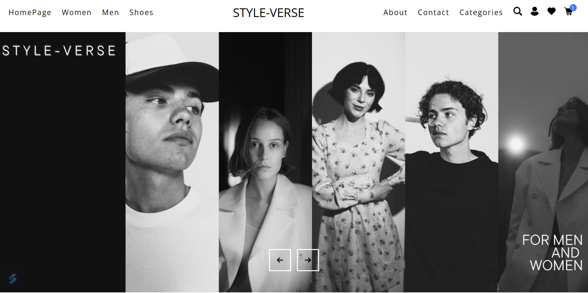
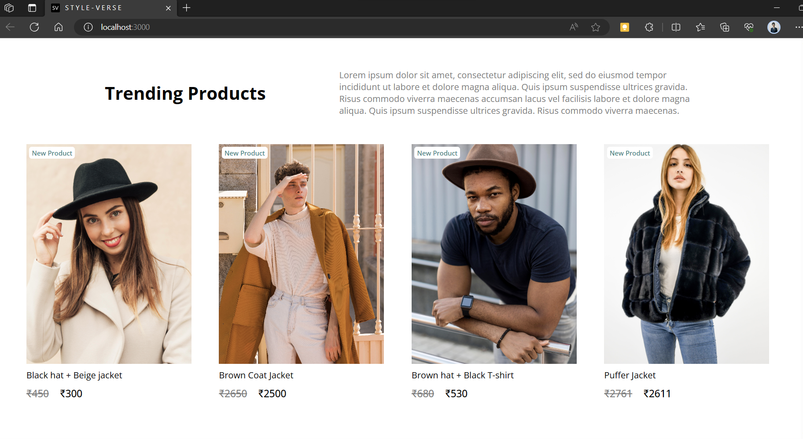
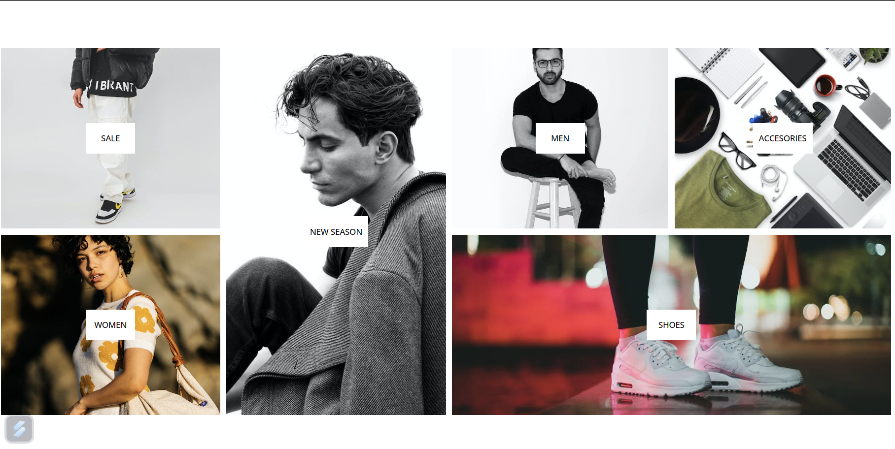
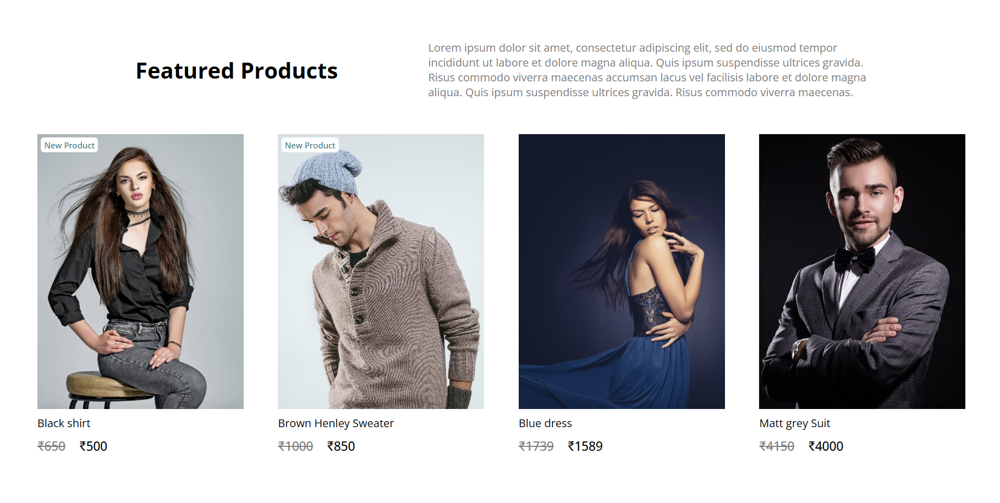
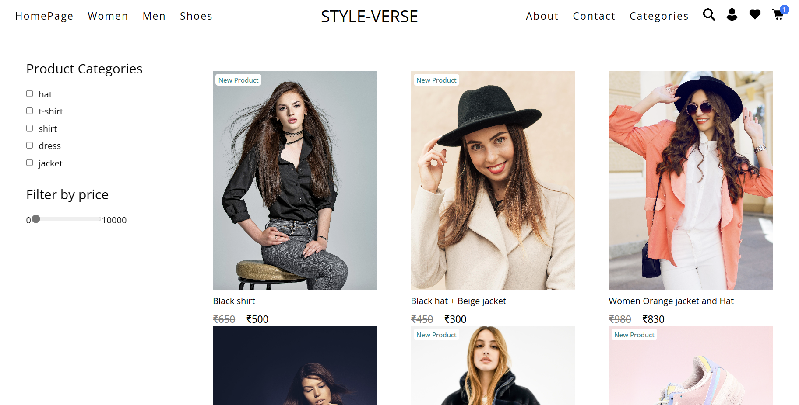
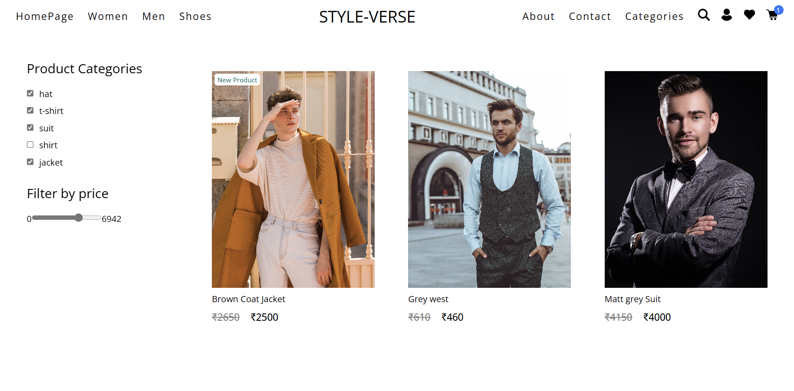
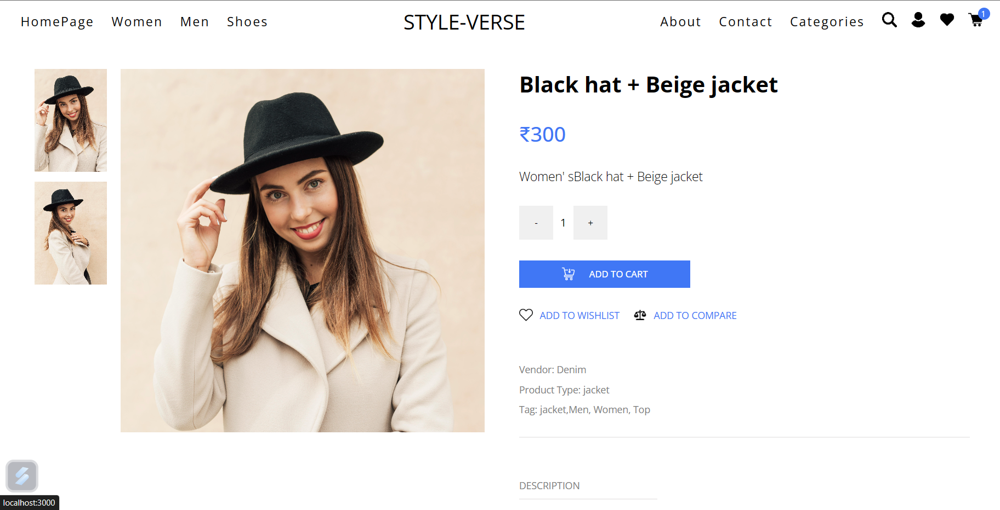
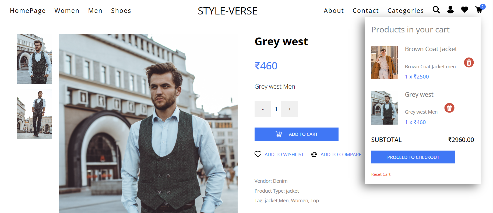
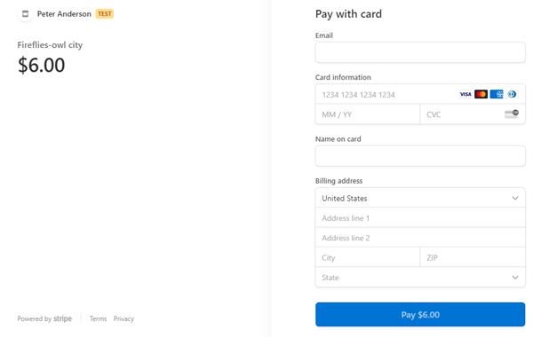
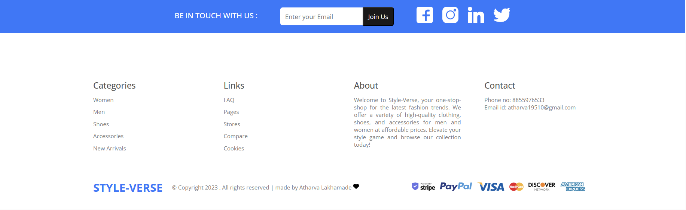

<h1> Style-Verse : Fashion website </h1> 

# About
• Developed Styleverse, a fashion e-commerce website using ReactJS • Proficiently utilized Strapi as a headless CMS (Content Management System) for managing website content, including products, categories, and pages, and for creating Rest API and back-end services. • Implemented Stripe as the payment gateway for secure and seamless online transactions • Utilized Redux Toolkit to provide users with efficient cart functionality for their selected products • Utilized Sass to create a visually appealing website design

# Screenshots
<h2>Homepage👆</h2>
<h2>Trending Products👆</h2>
<h2>Categories👆</h2>
<h2>Featured Products👆</h2>
<h2>Women Category👆</h2>
<h2>Men's Category With Filtered Products👆</h2>
<h2>Single Product👆</h2>
<h2>Add & Delete Product to Cart👆</h2>
<h2>Payment gateaway With Stripe👆</h2>
<h2>Footer👆</h2>

# Tech Stack

